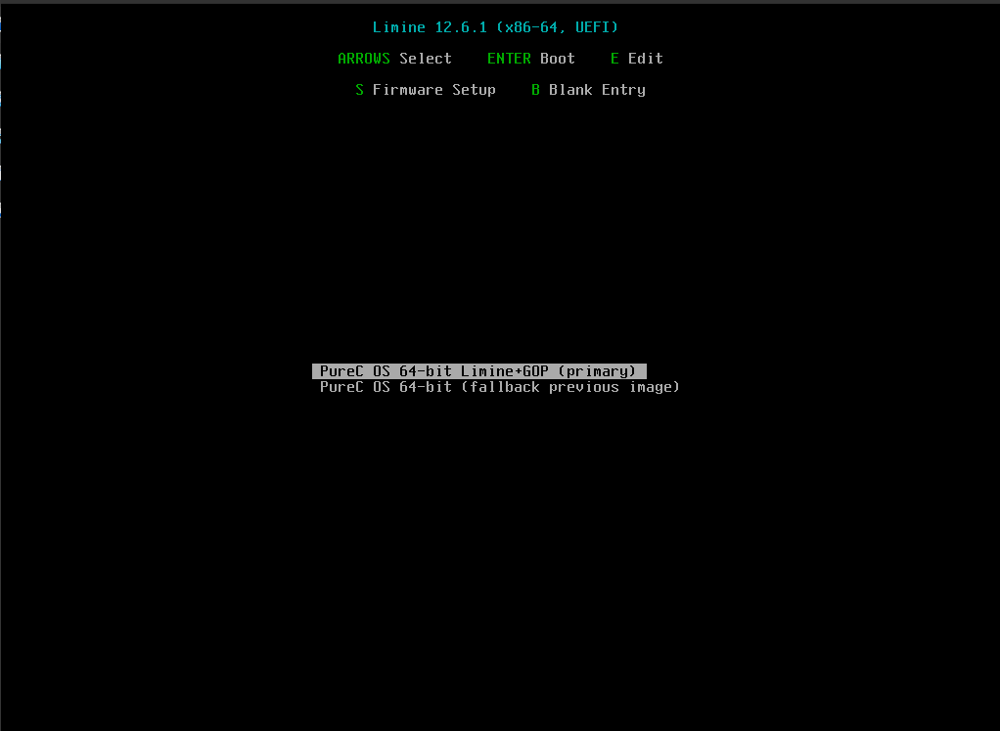
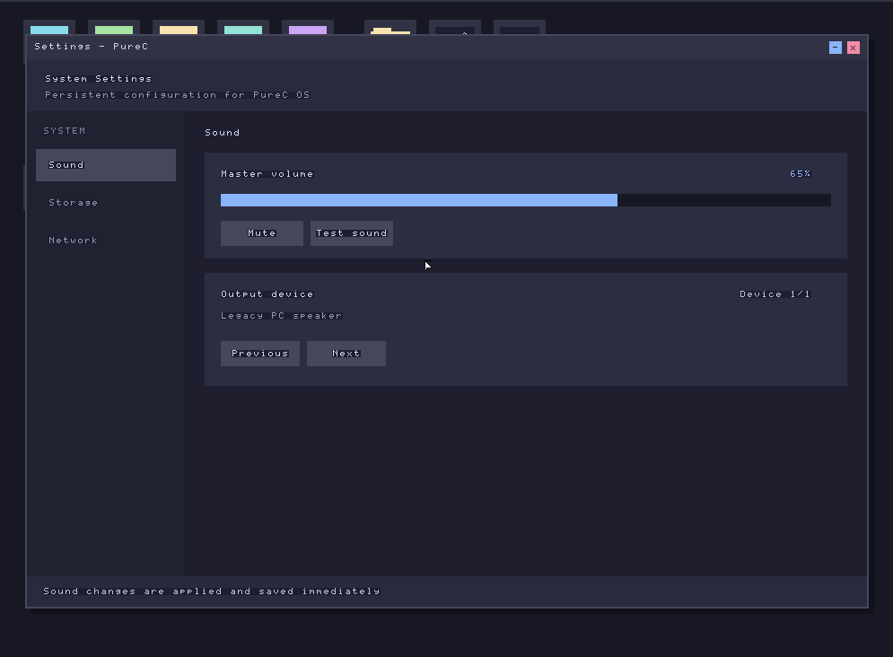
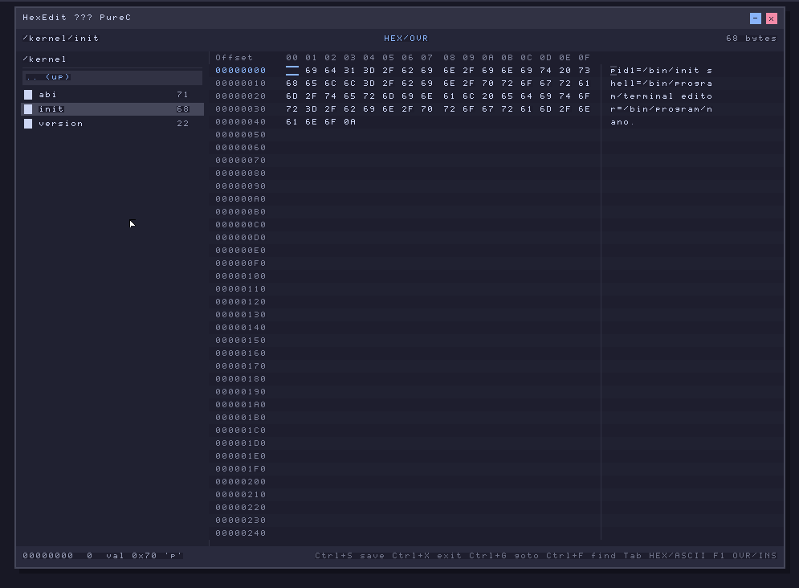

# PureC OS


PureC OS - это простая 64-битная операционная система, написанная на C и ассемблере. Она включает в себя 
- UserSpace
- Интернет поддержка только в VirtualBox Инетрфейс только Intel Pro 100 82540EM
- Файлловую систему FAT32 и VFS и EXT2 
- Реализованы драйверы экрана, клавиатуры и диска
- Реализованы драйверы USB
- User Программы В Ring 3


## Сборка и запуск
<details>
<summary><b>Linux (Ubuntu)</b></summary>

На Ubuntu:
```bash
sudo apt update
sudo apt install make gcc g++ limine nasm
```

Если нет в репах (старый Ubuntu), то нужно установить `limine` вручную.

```bash
sudo apt install xorriso mtools
git clone https://github.com/limine-bootloader/limine.git --branch=v8.x-binary --depth=1
cd limine && make
```

### Ставив Кросс-компилятор для x86_64

```bash
sudo apt install build-essential bison flex libgmp-dev libmpc-dev libmpfr-dev texinfo

# Качаем исходники

wget https://ftp.gnu.org/gnu/binutils/binutils-2.42.tar.gz
wget https://ftp.gnu.org/gnu/gcc/gcc-14.1.0/gcc-14.1.0.tar.gz

tar -xf binutils-2.42.tar.gz
tar -xf gcc-14.1.0.tar.gz

# Собираем binutils

mkdir build-binutils && cd build-binutils
../binutils-2.42/configure --target=x86_64-elf --prefix=/usr/local --with-sysroot --disable-nls --disable-werror
make -j$(nproc) && sudo make install
cd ..

# Собираем GCC

mkdir build-gcc && cd build-gcc
../gcc-14.1.0/configure --target=x86_64-elf --prefix=/usr/local --disable-nls --enable-languages=c,c++ --without-headers
make all-gcc -j$(nproc) && sudo make install-gcc
make all-target-libgcc -j$(nproc) && sudo make install-target-libgcc
```
</details>

<details>
<summary><b>Linux (Fedora)</b></summary>
На Fedora:
```bash
sudo dnf update --refresh
sudo dnf install make gcc g++ limine nasm
```
Если нет в репах (старый Fedora), то нужно установить `limine` вручную.

```bash
sudo dnf install xorriso mtools
git clone https://github.com/limine-bootloader/limine.git --depth=1
cd limine && make
```

### Ставив Кросс-компилятор для x86_64 Fedora


```bash
sudo dnf install gcc gcc-c++ make bison flex gmp-devel libmpc-devel mpfr-devel texinfo

# Качаем исходники
wget https://ftp.gnu.org/gnu/binutils/binutils-2.42.tar.gz
wget https://ftp.gnu.org/gnu/gcc/gcc-14.1.0/gcc-14.1.0.tar.gz

tar -xf binutils-2.42.tar.gz
tar -xf gcc-14.1.0.tar.gz

# Собираем binutils
mkdir build-binutils && cd build-binutils
../binutils-2.42/configure --target=x86_64-elf --prefix=/usr/local --with-sysroot --disable-nls --disable-werror
make -j$(nproc) && sudo make install
cd ..

# Собираем GCC
mkdir build-gcc && cd build-gcc
../gcc-14.1.0/configure --target=x86_64-elf --prefix=/usr/local --disable-nls --enable-languages=c,c++ --without-headers
make all-gcc -j$(nproc) && sudo make install-gcc
make all-target-libgcc -j$(nproc) && sudo make install-target-libgcc
```

</details>

<details>
<summary><b>Linux (Arch)</b></summary>

```bash
sudo pacman -Syu

// Установить базовые зависимости
sudo pacman -S --needed base-devel git

// Установить зависимости
sudo pacman -S make gcc g++ limine nasm
```

### Скачайте исходный код `yay` из официального репозитория AUR:
```bash
git clone https://aur.archlinux.org/yay.git
```

### Переход в директорию и сборка
Перейдите в папку с клонированным проектом и запустите сборку и установку пакета:
```bash
cd yay
makepkg -si
```

### Проверьте установку `yay`:
```bash
yay -V
```

## Собераем крос компилятор для x86_64
```bash
yay -S x86_64-elf-gcc x86_64-elf-binutils
```

## Ставим VirtualBox

### Установка пакетовОбновите систему и установите основной пакет:
```bash
sudo pacman -S virtualbox
```


### Выберите хост-модули ядра 
В зависимости от вашего ядра (обычно используется virtualbox-host-modules-arch для стандартного ядра Linux или virtualbox-host-dkms, если вы используете кастомное или ZEN-ядро):
```bash
sudo pacman -S virtualbox-host-modules-arch
```
### Настройка после установки
Добавьте вашего пользователя в группу vboxusers, чтобы получить доступ к USB-устройствам:
```bash
sudo usermod -aG vboxusers $USER
```

### Загрузите модули ядра (или перезагрузите компьютер):
```bash
sudo modprobe vboxdrv
```

</details>


--- 

# Demo Foto
## Boot Screen

## UserSpace

## Systemsetings

## Network

## Filesystem

## Hex Editor

## System Monitor
