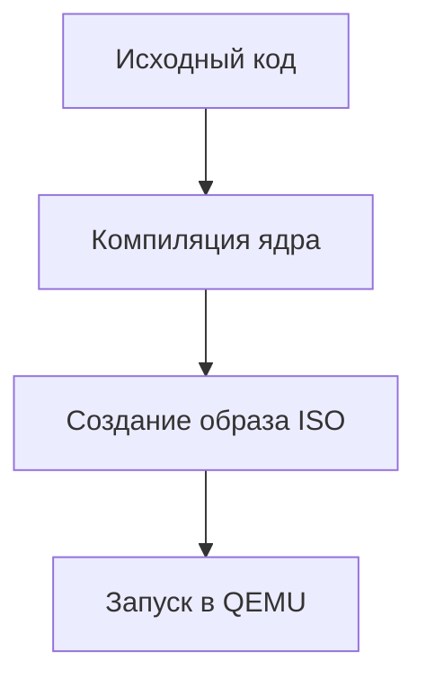

# 🚀 PureC OS


PureC OS - это простая 64-битная операционная система, написанная на C и ассемблере. Она включает в себя 
- базовую оболочку
- поддержку дисков
- файловую систему FAT32 и VFS
- реализованы драйверы экрана, клавиатуры и диска
- реализованы скрипты для автоматической сборки и запуска в QEMU


## 📋 Содержание
1. [Особенности](#✨-особенности)
2. [Требования](#⚙️-требования)
3. [Сборка и запуск](#🛠️-сборка-и-запуск)
4. [Структура проекта](#📂-структура-проекта)
5. [Лицензия](#📜-лицензия)
6. [Разработчики](#👥-разработчики)

## ✨ Особенности

| Компонент       | Описание                                                                 |
|-----------------|-------------------------------------------------------------------------|
| 🧠 Ядро         | Реализовано на чистом C с минимальными зависимостями                   |
| 🖥️ Оболочка     | Базовая командная строка с поддержкой основных команд                   |
| 💾 Файловая система | Поддержка FAT16 с базовыми операциями чтения/записи                   |
| 🔌 Драйверы     | Реализованы драйверы экрана, клавиатуры и диска                        |
| 🛠️ Инструменты  | Скрипты для автоматической сборки и запуска в QEMU                     |

## ⚙️ Требования

- **Минимальные:**
  - GCC 9.4+ (с поддержкой 32-битной компиляции)
  - NASM 2.15+
  - QEMU 5.0+
  - 512MB RAM

- **Рекомендуемые:**
  - 64-битная Linux-система (Ubuntu/Debian)
  - 2GB свободного места на диске
  - Поддержка виртуализации CPU

## 🛠️ Сборка и запуск

### 📦 Быстрый старт
```bash
# Клонировать репозиторий
git clone https://github.com/pablaofficeal/My-OS-Kernel-C.git
cd purec-os

# Установить зависимости (Debian/Ubuntu)
sudo apt install build-essential nasm grub-common xorriso qemu-system-x86


# Сборка и запуск
./build.sh && ./run.sh
```

### 🔍 Детальные инструкции

#### Сборка ISO-образа

Скрипт `build-limine.sh` отдельно создаёт ядро, `libpurec.a` и ring-3 программы
`/bin/init`, `/bin/installer`, `/bin/snake`. Установщик и змейка не линкуются
в образ ядра. При установке змейка также копируется в `/game/snake`.


```mermaid
graph TD
  A[Исходный код] --> B[Компиляция ядра]
  B --> C[Создание образа ISO]
  C --> D[Запуск в QEMU]
```

1. Компиляция ядра:
   ```bash
   make kernel
   ```

2. Создание загрузочного образа:
   ```bash
   make iso
   ```

3. Запуск системы:
   ```bash
   make run
   ```

## 📂 Структура проекта

```
purec-os/
├── src/               # Исходные коды
│   ├── kernel/       
│   ├── drivers/      
│   ├── lib/          
│   └── fs/           
├── docs/             # Документация
├── scripts/          # Скрипты сборки
├── LICENSE
└── README.md
```

## 📜 Лицензия

Проект распространяется под лицензией [GPLv3](LICENSE).
