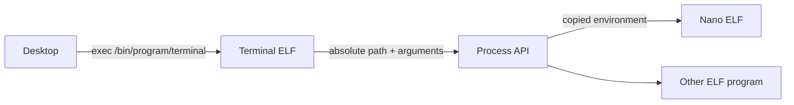

# ADR-005: Standalone Terminal, Nano and Process Environment

## Status
Accepted

## Requirements
- Terminal and nano must be independent ring-3 ELF programs.
- The kernel image must not link their application code.
- The shell must stay small and require an explicit absolute executable path.
- Processes need private environment variables inherited by children.
- Nano must receive its file operand without relying on kernel-global state.

## Decision
Store a bounded command line and environment table in each process. `SYS_EXEC`
accepts an optional command-line string and copies the parent's environment.
Dedicated syscalls expose command-line and environment access through
`libpurec.a`.

Build terminal and nano as boot modules at `/bin/program/terminal` and
`/bin/program/nano`. The desktop terminal icon starts the terminal module as a
foreground process. The shell implements only session builtins and delegates
all external behavior to an absolute program path.

## Trade-offs
- Fixed limits keep allocation deterministic: 16 variables, 31-byte names,
  127-byte values and a 255-byte command line.
- The current loader executes trusted Limine modules, not arbitrary ELF files
  read from FAT32. Installed programs therefore remain listed as boot modules.
- `PATH` exists as environment data but is intentionally empty and is not
  searched. This enforces explicit executable paths.
- Command-line parsing is deliberately small and does not yet support quoting
  or file names containing spaces.

## Failure Modes and Security
- Invalid user pointers are rejected before process or environment access.
- Oversized command lines, names, values and output buffers are rejected.
- A full environment table makes `set` fail without modifying other entries.
- Child changes cannot mutate the parent's environment.
- A missing terminal or nano boot module makes `exec` fail and returns control
  to the desktop or shell.

## Alternatives Considered
- Keeping terminal rendering and nano in the linked desktop was rejected
  because an application fault would still execute in ring 0.
- Searching `PATH` was deferred because the requested shell requires explicit
  paths and the loader currently has a trusted-module boundary.
- Placing `argv` and `envp` directly on the initial user stack was deferred
  until a common C runtime entry point replaces the current `_start` functions.
